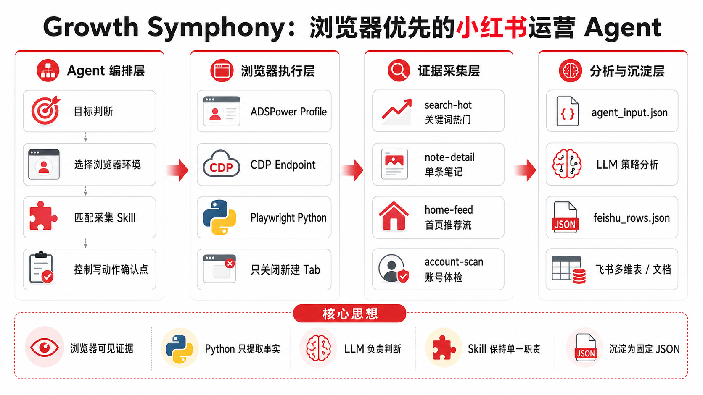

# Growth Symphony

增长/运营超级 agent 工作区。小红书是第一个模块。

## 架构图



这张图是本项目的目标架构：吸收 `redbook` 与 `xiaohongshu-ops-skill` 的分析思想和运营场景，但执行方式保持浏览器优先，不继承它们的 Cookie/API 运行方式。

## 职责

- 判断用户目标属于哪个运营场景。
- 选择合适的账号区、浏览器 profile、工具链和模块。
- 编排浏览器操作、证据采集、分析总结和复盘沉淀。

## 当前模块

| 模块 | 状态 | 说明 |
| --- | --- | --- |
| `xiaohongshu` | 可跑 | 小红书关键词采集、关键词矩阵、单条笔记采集、首页推荐流采集、账号体检采集、笔记复刻、策略分析。 |

## 安装

```bash
cd /Users/admin/growth-symphony
npm install
python3 -m pip install -r requirements.txt
```

## 环境检测

```bash
cd /Users/admin/growth-symphony
command -v ads
npm run browser-env -- list
```

## 运行

```bash
cd /Users/admin/growth-symphony
export BROWSER_CDP_ENDPOINT="$(
  npm run --silent browser-env -- cdp "测试环境1" |
  python3 -c 'import json,sys; print(json.load(sys.stdin)["cdp_endpoint"], end="")'
)"
npm run xhs:search-hot -- --keyword "AI编程"
npm run xhs:keyword-matrix -- --keyword "拼豆" --keyword "拼豆图纸" --keyword "拼豆教程"
npm run xhs:note-detail -- --url "https://www.xiaohongshu.com/..."
npm run xhs:viral-copy-context -- --input "/path/to/agent_input.json" --topic "你的课题"
npm run xhs:home-feed
npm run xhs:account-scan -- --url "https://www.xiaohongshu.com/user/profile/..."
```

用户没指定浏览器环境时，agent 先读取可用环境列表，让用户从环境名、编号或 profile_id 中确认要用哪一个。

顶层环境脚本会使用 `ads` CLI 查询和打开 ADSPower profile：

```bash
npm run browser-env -- list
npm run browser-env -- cdp "测试环境1"
```

默认采样：

- `search-hot`：20 条搜索卡片，3 条详情页。
- `keyword-matrix`：每个关键词 12 条搜索卡片，1 条详情页。
- `note-detail`：单条笔记，最多 30 条可见评论。
- `viral-copy`：读取 `agent_input.json`，生成复刻上下文和固定输出模板。
- `home-feed`：20 条首页推荐卡片，3 条详情页。
- `account-scan`：15 条近期笔记，3 条详情页。

采集命令返回 `agentInputPath` 和 `feishuRowsPath`。

`note-detail` 会输出 `author.profile_url`。需要账号体检时，agent 可以直接把这个 URL 交给 `account-scan`。

## 小红书分析链路

```text
xiaohongshu-ops-agent
  -> search-hot / keyword-matrix / note-detail / home-feed / account-scan 采集浏览器证据
  -> viral-copy 读取 agent_input.json 生成复刻上下文
  -> strategy-analysis 读取 agent_input.json 做策略判断
  -> feishu-skill 读取 feishu_rows.json 写入多维表
```

Python 脚本只提取可见证据和结构化信号，例如标题钩子、正文结构、评论主题、可见互动比例。它不生成固定选题、不写机会等级、不写推荐理由。不同课题的判断由 agent/LLM 基于 `agent_input.json` 完成。

## 数据沉淀

- 采集 skill 只负责浏览器证据和本地输出。
- `agent_input.json` 是策略分析输入。
- `feishu_rows.json` 是多维表导入用的固定 JSON，分析字段可由 `strategy-analysis` 补全。
- 多维表适合长期跟踪关键词、标题、互动信号、选题方向。
- 文档适合沉淀单次分析报告和人工复盘。
- 飞书导入由 `modules/feishu/skills/feishu-skill` 读取 `feishu_rows.json`，通过飞书 CLI 写入固定多维表。
- 飞书未配置前，可先执行 `npm run feishu:bitable-payload -- --input /path/to/feishu_rows.json` 生成本地待导入包。

## 边界

- 不把平台账号 key、API key、Cookie 写进仓库文件。
- `ADS_API_KEY` 只放环境变量或本机 shell 配置，不写进仓库。
- 不读取或导出 Cookie。
- 不调用平台私有接口做内容分析。
- 默认不点赞、不收藏、不评论、不发布。
- 写动作先停在确认点。
